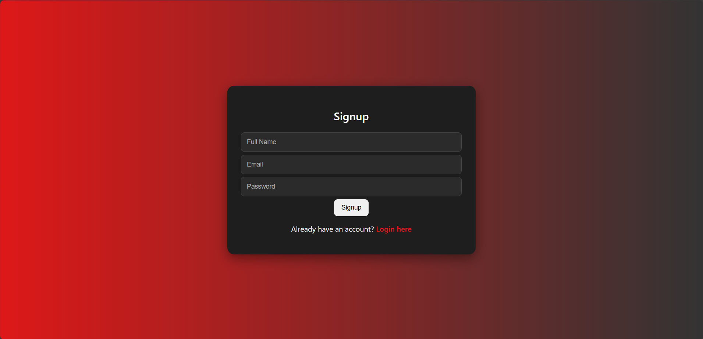
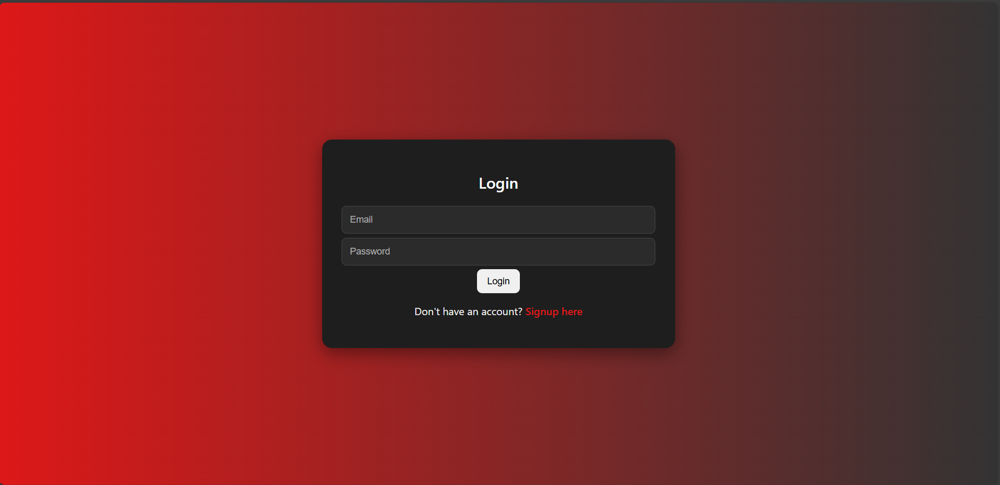
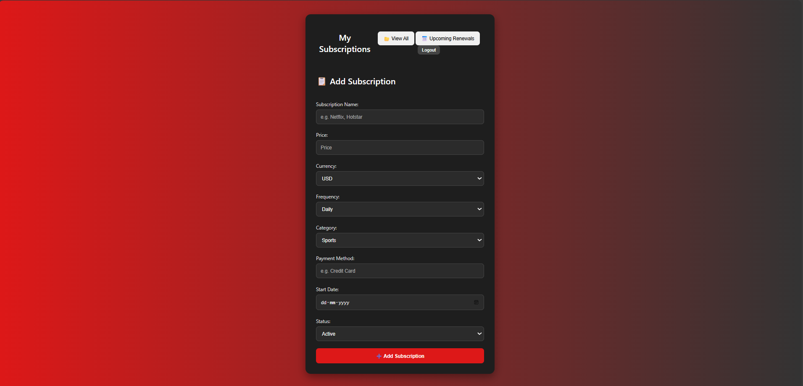
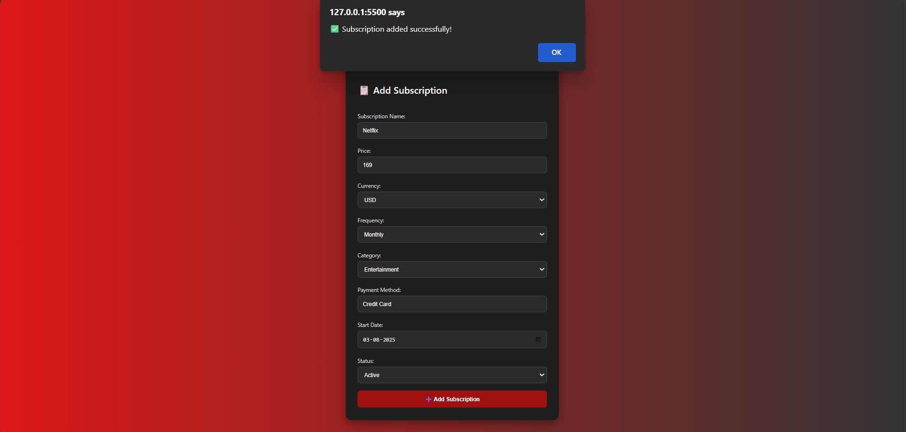
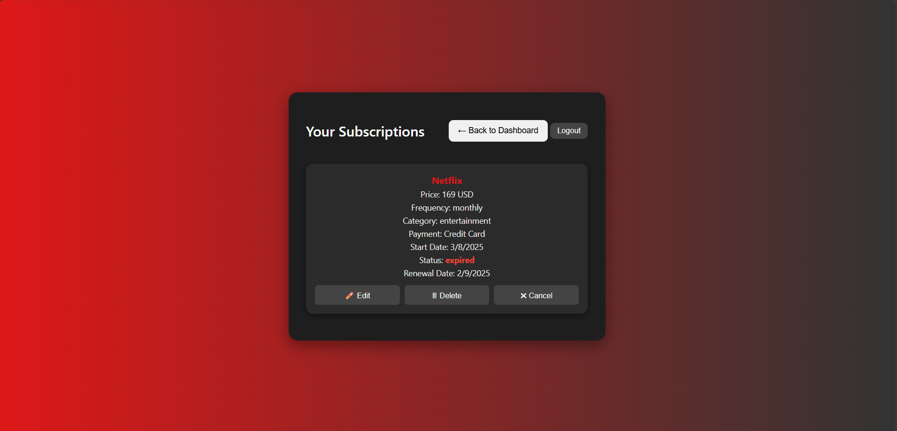
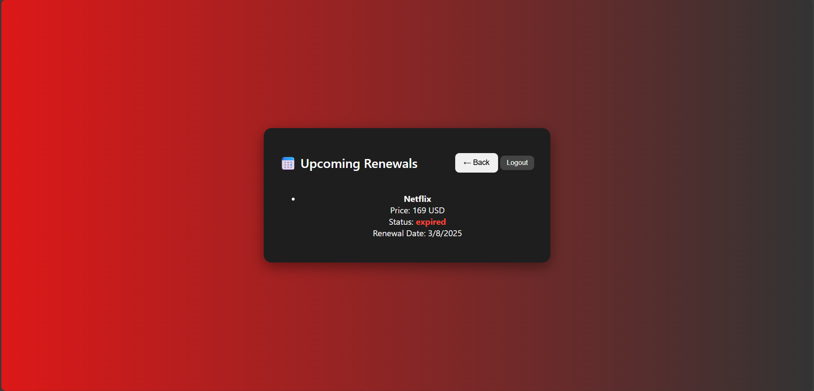

---

# 📌 Subscription Tracker

## 📖 Project Overview

**Subscription Tracker** is a full-stack web application that helps users **manage, monitor, and control their subscriptions** (like Netflix, Hotstar, Spotify, etc.).
It provides features to add, edit, cancel, and delete subscriptions, along with a dashboard to track **upcoming renewals** so users never miss a payment.

This project is built with a **Node.js + Express + MongoDB backend** and a **Vanilla HTML/CSS/JavaScript frontend**.

---

## ✨ Features

### 🔐 Authentication

* User sign-up and login with JWT authentication
* Secure session management

### 📂 Subscription Management

* Add new subscriptions with details:

  * Name, Price, Currency, Frequency, Category, Payment Method, Start Date, Status
* Edit subscriptions inline (switch between view mode and edit mode)
* Cancel or Delete subscriptions
* Expired subscriptions are locked (cannot be modified)

### 📅 Renewal Tracking

* View upcoming renewals within the next 7 days
* Renewal dates are automatically calculated based on frequency

### 📊 Dashboard

* Clean and modern UI with gradient theme
* Add new subscriptions directly from the dashboard
* Quick navigation to:

  * **View All Subscriptions**
  * **Upcoming Renewals**
  * **Logout**

---

## 🛠️ Tech Stack

* **Frontend:** HTML, CSS, JavaScript (Vanilla)
* **Backend:** Node.js, Express.js
* **Database:** MongoDB (Mongoose ORM)
* **Authentication:** JWT (JSON Web Tokens)
* **Styling:** Custom CSS with gradient background and card-based layout

---

## 🚀 Future Enhancements

* Notifications/Email reminders for renewals
* Graphical insights (monthly spending trends)
* Multi-user dashboard with role-based access
* Export subscriptions to CSV/PDF

---

## 📸 Screenshots

* **Sig-Up**
  

* **LogIn**
  


* **Dashboard** – Add new subscriptions


  

* **Subscriptions Page** – View, edit, cancel, delete
  

* **Upcoming Renewals** – List of subscriptions renewing soon
  


---

## 📦 Installation

```bash
# Clone the repository
git clone https://github.com/Vinayy163/subscription-tracker.git

Set Up Environment Variables

Create a new file named .env.local in the root of your project and add the following content:

# PORT
PORT=5500
SERVER_URL="http://localhost:5500"

# ENVIRONMENT
NODE_ENV=development

# DATABASE
DB_URI=

# JWT AUTH
JWT_SECRET=
JWT_EXPIRES_IN="1d"

# ARCJET
ARCJET_KEY=
ARCJET_ENV="development"

# UPSTASH
QSTASH_URL=http://127.0.0.1:8080
QSTASH_TOKEN=

# NODEMAILER
EMAIL_PASSWORD=

# Install backend dependencies
cd Backend
npm install

# Start backend server
Terminal 1 : npm run dev
Terminal 2 : npx @upstash/qstash-cli dev

# Open frontend
cd ../Frontend
# Open index.html in browser (or use Live Server in VS Code)
```

---

## <a name="links">🔗 Links</a>

- **Arcjet** - [https://launch.arcjet.com/4g2R2e4](https://launch.arcjet.com/4g2R2e4)  
- **Upstash** - [https://bit.ly/42ealiN](https://bit.ly/42ealiN) 

---

## 👤 Author

**Vinay K Hiremath**
📧 \vinaykhiremath2003@gmail.com
🌐 \https://github.com/Vinayy163

---
